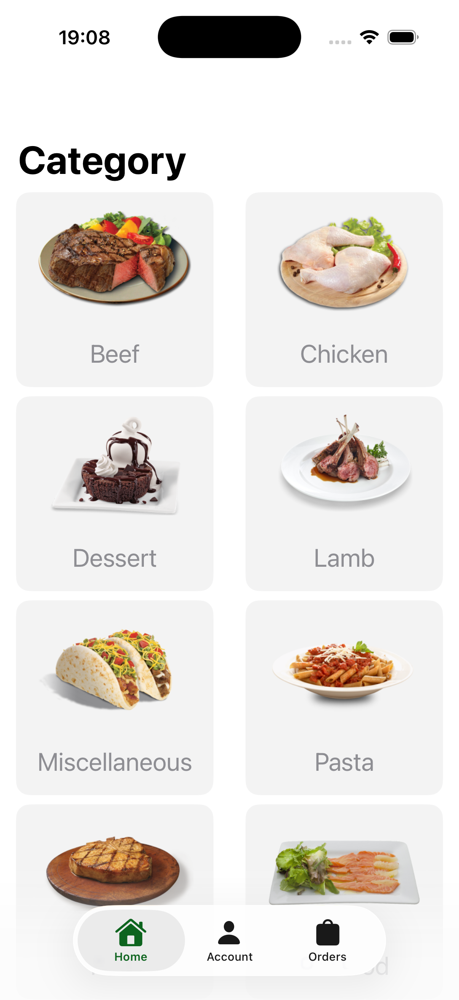
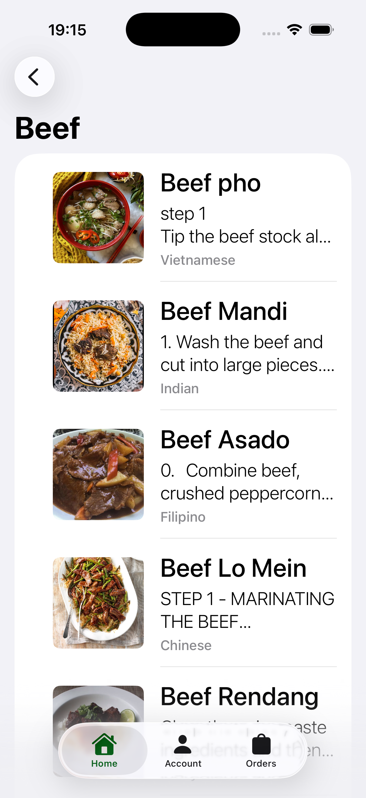
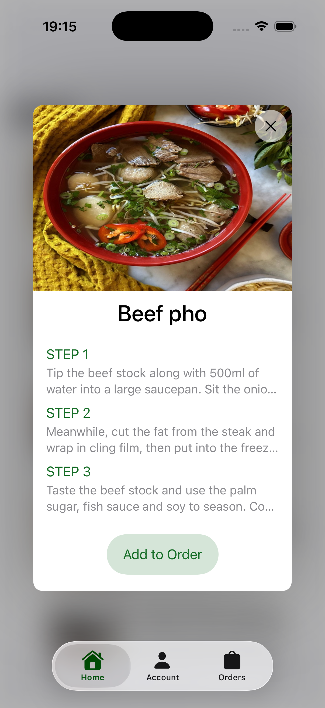
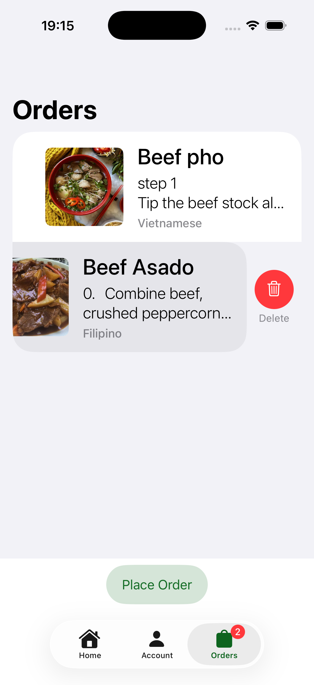

# Appetizers 🍽️

**Appetizers**, [TheMealDB](https://www.themealdb.com/api.php) API'sini kullanarak yemek kategorilerini, tariflerini ve detaylarını keşfetmenizi sağlayan bir iOS uygulamasıdır. SwiftUI ve MVVM mimarisi ile geliştirilmiştir.

## 📸 Ekran Görüntüleri

  
   
  
  

## ✨ Özellikler

- 🗂️ **Kategori Listesi** — TheMealDB'den çekilen yemek kategorilerini görüntüleme
- 🔎 **Yemek Arama & Listeleme** — Kategoriye göre yemekleri listeleme
- 📖 **Yemek Detayı** — Tarif adımları, bölge bilgisi ve YouTube video bağlantısı
- 🛒 **Sipariş (Order) Sistemi** — Yemekleri sepete ekleyip sipariş oluşturma, tab üzerinde badge ile adet gösterimi
- 👤 **Hesap Yönetimi** — Kullanıcı bilgilerini (ad, soyad, e-posta) formdan kaydetme, e-posta doğrulama
- 🖼️ **Görsel Önbellekleme** — `NSCache` ile indirilen görselleri cache'leme
- 🧭 **Navigation Routing** — `NavigationStack` ve özel `AppRouter` ile tab'lar arası yönlendirme
- ⚠️ **Hata Yönetimi** — `APError` ve `AlertContext` ile kullanıcı dostu uyarılar

## 🛠️ Kullanılan Teknolojiler

- **Swift** & **SwiftUI**
- **MVVM** mimari deseni
- **async/await** ile modern ağ istekleri (`URLSession`)
- `@Observable` (iOS 17+ Observation framework)
- `@StateObject`, `@EnvironmentObject`
- `NavigationStack` & `NavigationPath`
- `NSCache` (image caching)
- `FileManager` (kullanıcı verisi kalıcılığı)

## 📡 API

Uygulama [TheMealDB](https://www.themealdb.com/api.php) ücretsiz API'sini kullanır:

- `GET /categories.php` — Tüm kategorileri getirir
- `GET /search.php?s={meal}` — İsme göre yemek arar
- `GET /lookup.php?i={id}` — ID'ye göre yemek detayını getirir

## 🧩 Mimari

Proje **MVVM (Model-View-ViewModel)** deseni ile yapılandırılmıştır:

- **Model**: API'den gelen veriyi temsil eden `Codable` struct'lar (`Meal`, `Category`, `User`)
- **View**: SwiftUI ile yazılmış ekranlar; tek görevi UI'yi göstermek
- **ViewModel**: İş mantığı, API çağrıları ve state yönetimi — `@Observable` ile reaktif

Navigation, tab'a özel `NavigationPath`'leri yöneten merkezi bir `AppRouter` üzerinden yapılır.

## 📄 Lisans

Bu proje eğitim amaçlı geliştirilmiştir. Dilediğiniz gibi kullanabilir ve geliştirebilirsiniz.
